# MPP L1

Application web de recommandation de scores exacts pour **Mon Petit Prono Ligue 1**.

Le projet transforme les cotes du marché en probabilités de scores exacts, estime la popularité probable de chaque score dans le peloton MPP, puis propose trois stratégies :

- **Leader** : le score le plus probable ;
- **Équilibré** : le score maximisant l'espérance de points ;
- **Challenger** : un score plus différenciant, mais restant suffisamment plausible.

L'application est pensée pour être **simple, testable et rapide à déployer sur Vercel**.

---

## Fonctionnalités

### MVP

- Import des matchs de Ligue 1
- Import manuel ou CSV des cotes
- Dévigoration des probabilités bookmakers
- Modèle Poisson
- Correction Dixon–Coles
- Estimation des buts attendus domicile / extérieur
- Distribution complète des scores exacts
- Modèle du peloton MPP
- Calcul de l'espérance de points
- Recommandations Leader / Équilibré / Challenger
- Page par journée
- Fiche détaillée par match
- Historisation immuable des prédictions
- Backtest walk-forward
- Déploiement Vercel

### Évolutions prévues

- Import automatique des cotes
- Calibration du peloton à partir de données MPP réelles
- Modèle dynamique des forces des clubs
- Régimes spécifiques Ligue 1
- Race Engine basé sur le classement privé
- Simulations Monte Carlo
- Comptes utilisateurs
- Historique personnel des pronostics

---

## Stack technique

| Domaine         | Technologie        |
| --------------- | ------------------ |
| Framework       | Next.js App Router |
| Langage         | TypeScript         |
| UI              | React              |
| CSS             | Tailwind CSS       |
| Base de données | PostgreSQL         |
| Backend DB      | Supabase           |
| Hébergement     | Vercel             |
| Validation      | Zod                |
| Tests unitaires | Vitest             |
| Tests E2E       | Playwright         |

Le moteur mathématique est implémenté directement en **TypeScript**.

Aucun service Python ou microservice séparé n'est nécessaire pour le MVP.

---

# Architecture

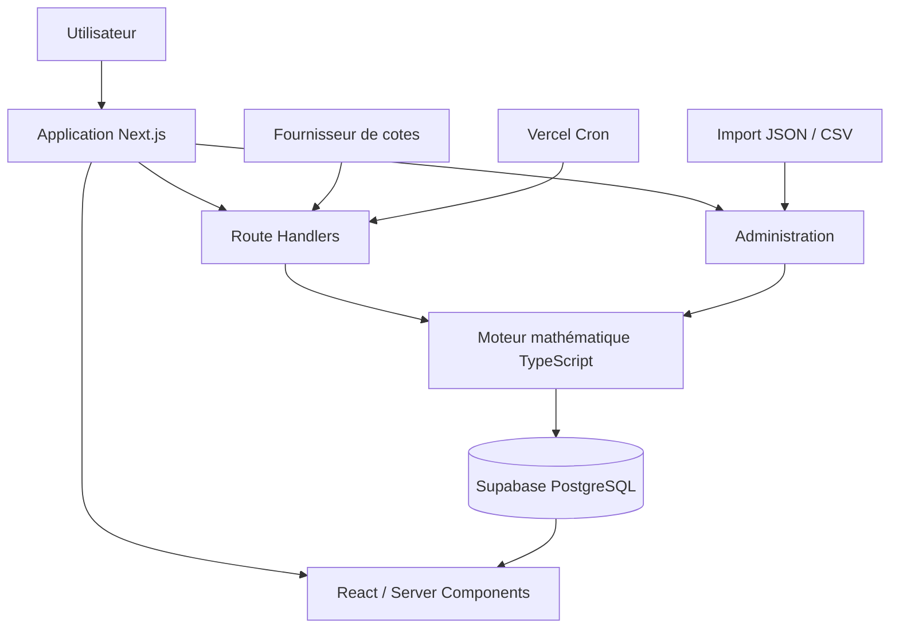

L'application reste volontairement monolithique :

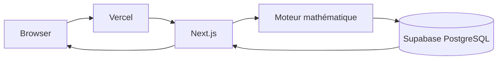

---

# Pipeline du modèle

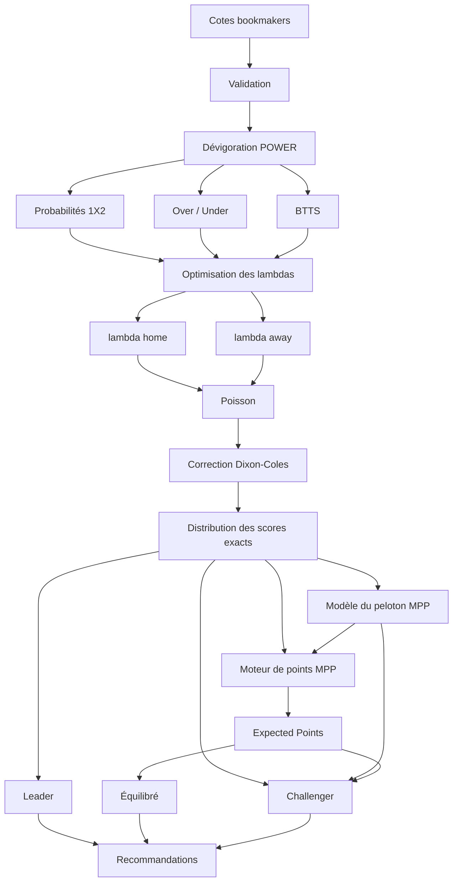

---

# Flux d'une prédiction

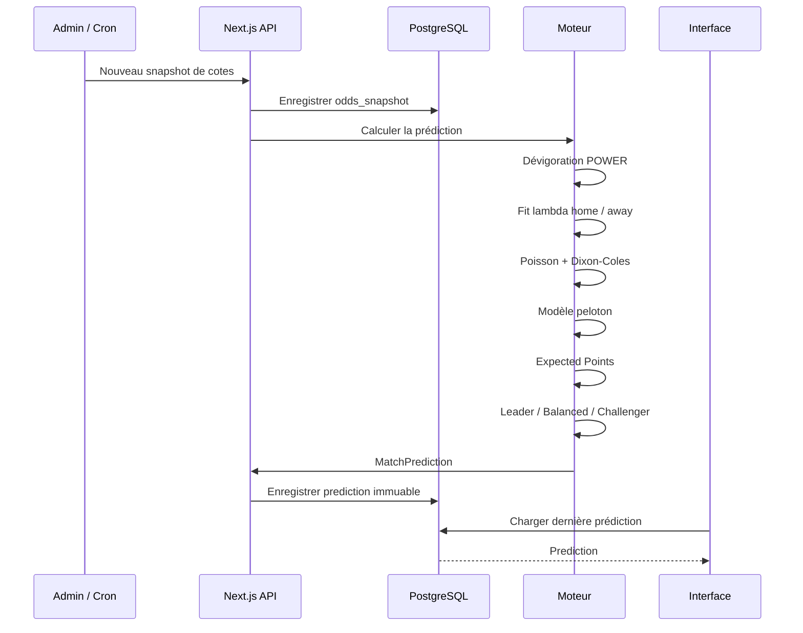

---

# Structure du projet

```text
.
├── app/
│   ├── layout.tsx
│   ├── page.tsx
│   │
│   ├── journee/
│   │   └── [round]/
│   │       └── page.tsx
│   │
│   ├── match/
│   │   └── [matchId]/
│   │       └── page.tsx
│   │
│   ├── classement/
│   │   └── page.tsx
│   │
│   ├── admin/
│   │   ├── page.tsx
│   │   └── imports/
│   │
│   └── api/
│       ├── matches/
│       │   └── route.ts
│       ├── predictions/
│       │   └── route.ts
│       ├── calculate/
│       │   └── route.ts
│       ├── admin/
│       │   ├── import-odds/
│       │   │   └── route.ts
│       │   └── recalculate/
│       │       └── route.ts
│       └── cron/
│           └── update/
│               └── route.ts
│
├── components/
│   ├── match-card.tsx
│   ├── score-pick.tsx
│   ├── score-matrix.tsx
│   ├── confidence-badge.tsx
│   └── market-summary.tsx
│
├── lib/
│   ├── model/
│   │   ├── types.ts
│   │   ├── poisson.ts
│   │   ├── dixon-coles.ts
│   │   ├── score-grid.ts
│   │   ├── devig-power.ts
│   │   ├── optimizer.ts
│   │   ├── crowd-model.ts
│   │   ├── mpp-rules.ts
│   │   ├── expected-value.ts
│   │   ├── leader.ts
│   │   ├── balanced.ts
│   │   ├── challenger.ts
│   │   ├── confidence.ts
│   │   └── race-engine.ts
│   │
│   ├── data/
│   │   ├── repositories/
│   │   └── providers/
│   │
│   ├── validation/
│   └── observability/
│
├── scripts/
│   ├── seed.ts
│   ├── import-history.ts
│   ├── backtest.ts
│   └── calibrate.ts
│
├── supabase/
│   └── migrations/
│
├── tests/
│   ├── unit/
│   └── integration/
│
├── e2e/
│
├── docs/
│   ├── CONCEPTION.md
│   └── adr/
│
├── vercel.json
├── package.json
├── tsconfig.json
└── README.md
```

---

# Installation

## Prérequis

- Node.js
- npm
- un projet Supabase
- un compte Vercel pour le déploiement

## Cloner le repository

```bash
git clone <URL_DU_REPOSITORY>
cd mpp-l1
```

## Installer les dépendances

```bash
npm install
```

---

# Configuration

Créer :

```text
.env.local
```

Exemple :

```env
NEXT_PUBLIC_SUPABASE_URL=
NEXT_PUBLIC_SUPABASE_ANON_KEY=

SUPABASE_SERVICE_ROLE_KEY=

ADMIN_SECRET=
CRON_SECRET=

ODDS_PROVIDER_API_KEY=
```

Ne jamais commit les secrets.

---

# Développement

Lancer l'application :

```bash
npm run dev
```

Puis ouvrir :

```text
http://localhost:3000
```

---

# Commandes

```bash
npm run dev
npm run build
npm run lint
npm run typecheck

npm test
npm run test:e2e

npm run db:migrate
npm run db:seed

npm run import:history
npm run backtest
npm run calibrate
```

Certaines commandes seront ajoutées progressivement avec le développement des modules concernés.

---

# Base de données

Les principales tables sont :

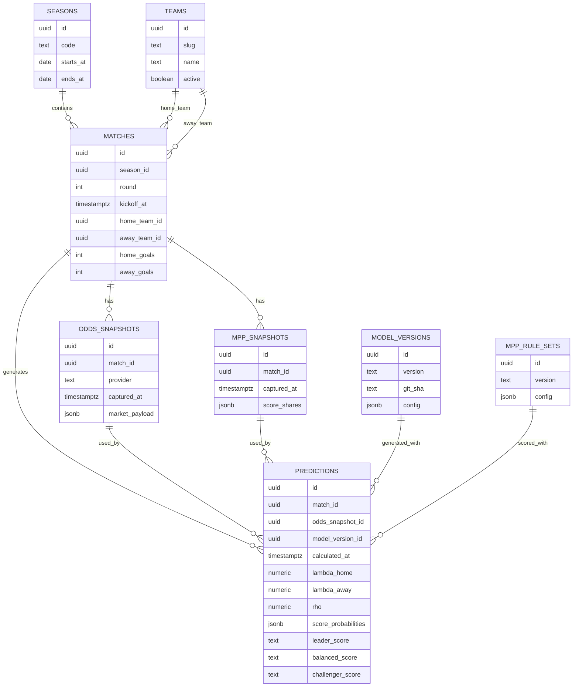

Les prédictions sont volontairement **immutables**.

Une nouvelle cote, un nouveau snapshot MPP ou une nouvelle version du modèle produit une nouvelle prédiction.

Une prédiction historique n'est jamais écrasée.

---

# Modèle mathématique

## Probabilités implicites

Pour une cote décimale (o_i) :

```math
q_i = \frac{1}{o_i}
```

La somme des probabilités implicites brutes est généralement supérieure à 1 en raison de la marge du bookmaker.

---

## Dévigoration POWER

Le modèle recherche un exposant (k) tel que :

```math
\sum_i q_i^k = 1
```

Puis :

```math
p_i = q_i^k
```

Les (p_i) représentent les probabilités fair utilisées par le moteur.

---

# Modèle de buts

On suppose :

```math
X \sim Poisson(\lambda_H)
```

et :

```math
Y \sim Poisson(\lambda_A)
```

avec :

- (\lambda_H) : buts attendus à domicile ;
- (\lambda_A) : buts attendus à l'extérieur.

La probabilité du score (i-j) vaut :

```math
P(i,j)
=
P(X=i)P(Y=j)
```

donc :

```math
P(i,j)
=
e^{-(\lambda_H+\lambda_A)}
\frac{\lambda_H^i}{i!}
\frac{\lambda_A^j}{j!}
```

---

# Dixon–Coles

La distribution Poisson est corrigée sur les faibles scores :

```text
0-0
0-1
1-0
1-1
```

avec un paramètre (\rho).

La correction permet de mieux modéliser la dépendance observée entre les buts des deux équipes sur ces scores.

Pour (\rho = 0), le modèle revient au Poisson indépendant.

---

# Estimation des lambdas

Les paramètres :

```text
lambda_home
lambda_away
```

sont obtenus en recherchant la distribution de scores qui reproduit au mieux les probabilités fair des marchés disponibles.

Exemples :

- 1X2 ;
- Over / Under 2.5 ;
- BTTS ;
- handicap asiatique.

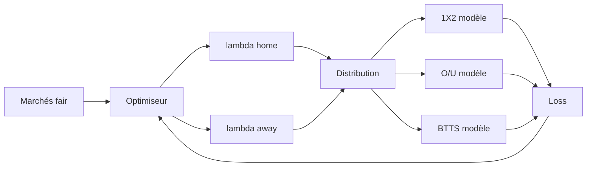

---

# Modèle du peloton

Le modèle football et le modèle du peloton sont séparés.

Le modèle football répond :

> Quelle est la probabilité que le match termine sur ce score ?

Le modèle peloton répond :

> Quelle proportion des joueurs MPP va pronostiquer ce score ?

Sans observation MPP réelle :

```math
q_s
=
\frac{P_s^\alpha}
{\sum_u P_u^\alpha}
```

où :

- (P_s) est la probabilité football ;
- (q_s) est la popularité estimée dans le peloton ;
- (\alpha) contrôle la concentration du peloton.

Le paramètre (\alpha) doit être calibré sur les données MPP disponibles.

---

# Expected Points

Pour chaque score proposé (s), le moteur considère tous les scores réels possibles (u).

```math
EV(s)
=
\sum_u
P(u)
\times
Points(s,u)
```

Cela permet de prendre en compte :

- le score exact ;
- la bonne issue sans score exact ;
- la rareté du score ;
- les règles MPP en vigueur.

---

# Stratégies

## Leader

Le Leader est le score le plus probable :

```math
s_L
=
\arg\max_s P_s
```

Il privilégie la probabilité de réussite et limite la variance.

---

## Équilibré

L'Équilibré maximise l'espérance de points :

```math
s_E
=
\arg\max_s EV(s)
```

Il constitue la stratégie par défaut.

---

## Challenger

Le Challenger cherche un score :

- suffisamment probable ;
- moins joué par le peloton ;
- avec une EV encore acceptable ;
- offrant davantage de différenciation.

Un score peut notamment être caractérisé par :

```math
edge_s
=
\log
\left(
\frac{P_s + \epsilon}
{q_s + \epsilon}
\right)
```

Le Challenger maximise ensuite une fonction combinant :

- Expected Points ;
- edge ;
- bonus de rareté.

---

# Relation entre les stratégies

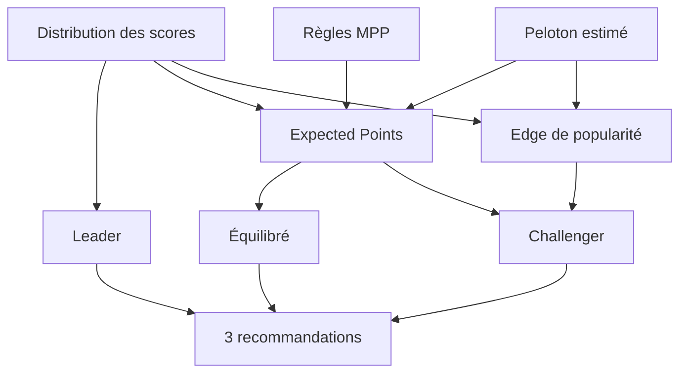

---

# Race Engine

Le Race Engine sera introduit dans une version ultérieure.

Il adaptera la stratégie au contexte du joueur :

- classement ;
- points ;
- écart avec le leader ;
- nombre de matchs restants ;
- taille de la ligue.

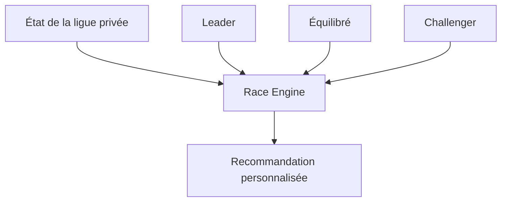

À terme, une simulation Monte Carlo pourra chercher directement à maximiser :

```math
P(\text{finir premier})
```

plutôt que simplement l'espérance de points.

---

# Validation

Le projet utilise une validation temporelle **walk-forward**.

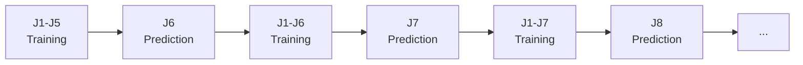

Une prédiction ne doit jamais utiliser une information postérieure à son cutoff.

---

# Métriques

## Football

- Log Loss
- Brier Score
- calibration 1X2
- calibration Score Exact
- Ranked Probability Score
- erreur de fit des marchés

## MPP

- points moyens par match
- points médians
- variance
- points cumulés
- gain contre baseline
- performance par stratégie
- performance par type de match
- performance par journée

---

# Tests d'ablation

Chaque ajout au modèle doit prouver son utilité.

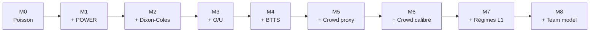

Une couche n'est conservée que si elle améliore les performances hors échantillon.

---

# Tests

## Tests unitaires

Modules concernés :

- Poisson
- Dixon–Coles
- POWER
- optimisation des lambdas
- probabilités 1X2
- Over / Under
- BTTS
- règles MPP
- Expected Points
- Leader
- Équilibré
- Challenger

Lancer :

```bash
npm test
```

---

## Tests d'intégration

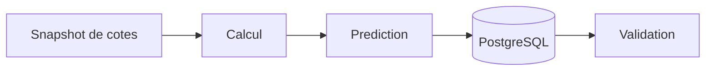

Les tests vérifient notamment :

- référence au bon snapshot ;
- somme des probabilités égale à 1 ;
- présence des trois stratégies ;
- immutabilité de la prédiction.

---

## Tests E2E

Playwright couvre notamment :

```text
Page journée
→ ouverture d'un match
→ affichage des stratégies
→ matrice des scores
→ niveau de confiance
```

Admin :

```text
Import cotes
→ calcul
→ création d'une prédiction
→ affichage
```

Lancer :

```bash
npm run test:e2e
```

---

# Déploiement

Le projet est prévu pour fonctionner directement sur Vercel.

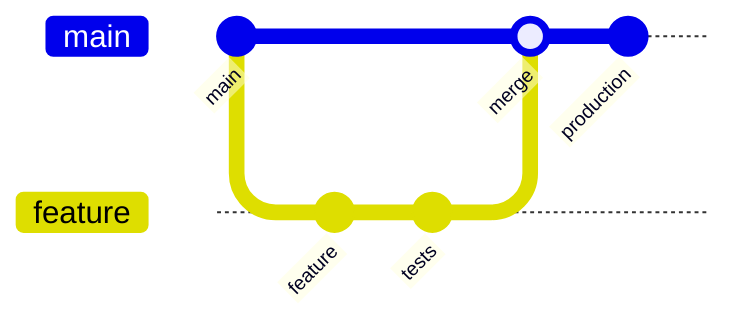

Workflow :

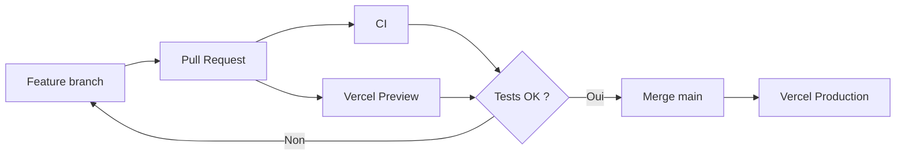

---

# Cron

À terme, les mises à jour automatiques suivront :

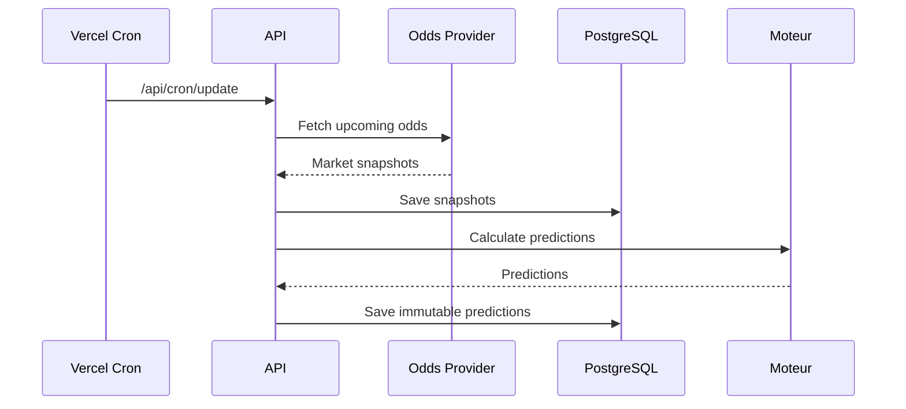

Le système conserve également un mode d'import manuel pour ne pas dépendre entièrement d'un fournisseur externe.

---

# Roadmap

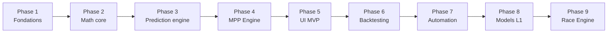

## Phase 1 — Fondations

- Next.js
- TypeScript
- Supabase
- CI
- Vercel

## Phase 2 — Math Core

- Poisson
- Dixon–Coles
- POWER
- projections de marchés
- optimisation des lambdas

## Phase 3 — Prediction Engine

- import des cotes
- snapshots
- calcul
- version du modèle
- persistance immuable

## Phase 4 — MPP Engine

- règles MPP
- modèle du peloton
- Expected Points
- Leader
- Équilibré
- Challenger

## Phase 5 — MVP

- page journée
- fiche match
- matrice des scores
- confiance
- import admin

## Phase 6 — Validation

- données historiques
- walk-forward
- baselines
- calibration
- tests d'ablation

## Phase 7 — Automatisation

- Odds Provider
- Cron
- monitoring
- gestion des données périmées

## Phase 8 — Modèles Ligue 1

- force des clubs
- time decay
- promus
- régimes / templates Ligue 1

## Phase 9 — Race Engine

- classement privé
- niveau d'urgence
- simulation des adversaires
- Monte Carlo
- optimisation de la probabilité de victoire

---

# Documentation

La documentation détaillée du projet se trouve dans :

```text
docs/CONCEPTION.md
```

Elle contient notamment :

- modèle mathématique complet ;
- architecture ;
- schéma de données ;
- API ;
- choix technologiques ;
- ADR ;
- stratégie de tests ;
- backtest scientifique ;
- calibration ;
- backlog agile détaillé ;
- roadmap ;
- risques.

---

# Principes du projet

## Pas de fuite temporelle

Une prédiction ne peut utiliser que des informations disponibles au moment de son calcul.

## Predictions immuables

Les prédictions historiques ne sont jamais modifiées.

## Pas de backtest réécrit

Une performance passée ne doit jamais être recalculée avec des données futures.

## Marché comme ancre

Les cotes bookmakers représentent la source probabiliste principale du MVP.

## Complexité gagnée par la donnée

Une feature supplémentaire n'est intégrée que si elle améliore les performances hors échantillon.

## Explicabilité

Chaque recommandation doit pouvoir être justifiée par :

- sa probabilité ;
- son Expected Points ;
- sa popularité estimée ;
- sa rareté ;
- son niveau de confiance.

---

# Statut du projet

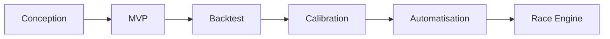

L'objectif initial est de fiabiliser la boucle :

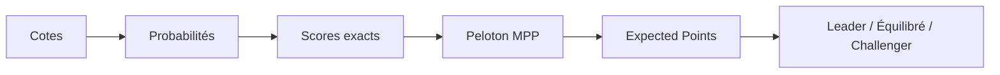

avant d'ajouter les modèles Ligue 1 avancés et la personnalisation.

---

# Références

- Dixon, M. J. & Coles, S. G. (1997)
  _Modelling Association Football Scores and Inefficiencies in the Football Betting Market._

- Next.js
  `https://nextjs.org`

- Vercel
  `https://vercel.com`

- Supabase
  `https://supabase.com`
